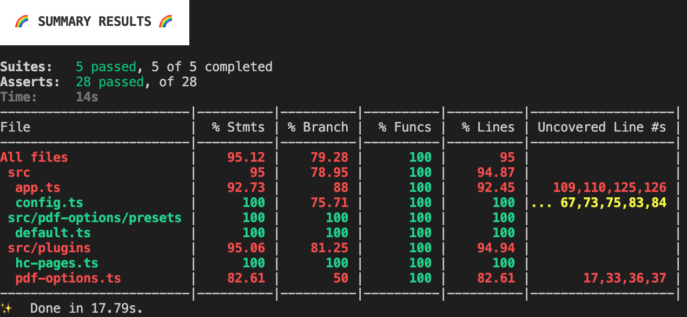

[](https://github.com/uyamazak/hc-pdf-server/actions?query=workflow%3Aci)

# hc-pdf-server

convert HTML to PDF server by Headless Chrome (Chromium).

GET URL or POST HTML returns PDF binary.

This is new version of [hcep-pdf-server](https://github.com/uyamazak/hcep-pdf-server/) with TypeScript and new features.

## New features compared to hcep-pdf-server

- Writing in TypeScript
- Use Fasity https://www.fastify.io/ instead of Express for native TypeScript support and speed
- Use alpine for less image size in Docker
- You can Change User Agent and Accept Language etc with env
- Bearer token authorization Support

# Getting Started

## Clone
git clone this repository.

You can try it in 2 ways: 1.`Docker` or 2.`Local`

## 1. Docker

### Requirement
You need install docker.

https://docs.docker.com/get-docker/


### Install Fonts (optionary)
If you wanto to convert pages in Japanese, Chinese or languages other than English with Docker.
You will need to install each font files.
Also, you can use WEB fonts, but since it takes a long time for requesting and downloading them,
we recommend that install the font files in the server.

#### 1. From font file
Add your font files (ex. *.otf) to `fonts/` dir.

```zsh
cp AnyFonts.ttf ./fonts/
```

And build image.

```zsh
docker build -t hc-pdf-server:latest .
```

#### 2. From apk package
You can use build-arg `ADDITONAL_FONTS` as package names.

See below available font package names.

https://wiki.alpinelinux.org/wiki/Fonts

```zsh
docker build \
  --build-arg ADDITONAL_FONTS=font-noto-cjk \
  -t hc-pdf-server:latest .

# multiple (split by space)
docker build \
  --build-arg ADDITONAL_FONTS="font-noto-cjk font-ipa" \
  -t hc-pdf-server:latest .
```


### Run
```zsh
docker run -it -p 8080:8080 hc-pdf-server:latest
```

## 2. Local (for development use)

### Requirement
You need to install Node.js and yarn.

- [Node.js](https://nodejs.org/)
- [yarn](https://classic.yarnpkg.com/)

install packages
```zsh
yarn install
```

start dev server
```zsh
yarn dev
```

lint and fix
```zsh
yarn lint
```

compile ts files
```zsh
yarn build
```

launch server
```zsh
yarn start
```

# Usage

## Get request with url parameter

```zsh
curl "http://localhost:8080?url=http://example.com" -o hcpdf-get.pdf
```
[hcpdf-get.pdf](/docs/pdf-samples/hcpdf-get.pdf)

## POST request with html parameter
```zsh
curl -sS http://localhost:8080 -v \
  -d html="<html><p>hcpdf <strong>ok</strong></p></html>"\
  -o hcpdf-post.pdf
```
[hcpdf-post.pdf](/docs/pdf-samples/hcpdf-post.pdf)

# Change PDF options by preset name

The Puppeteer's PDF options are flexible and complex.

I thought about taking them directly as GET or POST parameters, but it's not simple, so I make with the preset method.

Just pass the preset names (Object's keys) you have prepared as `pdfoptions` and you can use them.

The default presets are below.

[src/pdf-options/presets/default.ts](src/pdf-options/presets/defaults.ts)

You can extend it or create another file and switch it by environment variables.

```zsh
# make file
cp src/pdf-options/presets/my-preset.sample.ts src/pdf-options/presets/my-preset.ts

# edit
vim src/pdf-options/presets/my-preset.ts

# and set env example with dorcker run
docker run -it -p 8080:8080 \
  -e HCPDF_PDF_OPTION_PRESET_FILE_PATH='./presets/my-preset' \
  -e DEFAULT_PDF_OPTION_PRESET_NAME='MYA4' \
  hc-pdf-server:latest
```

The default is the minimum (e.g. A4, A3).

If you have something you think should be included, I'd be happy to receive a pull request.

You can check what options are currently available by looking at the following path after the server starts

```zsh
$ curl http://localhost:8080/pdfoptions
{"A4":{"format":"A4","margin":{"top":"10mm","bottom":"10mm","left":"10mm","right":"10mm"},"printBackground":true},"A3":{"format":"A3","margin":{"top":"10mm","bottom":"10mm","left":"10mm","right":"10mm"},"printBackground":true},"A4L":{"format":"A4","landscape":true,"margin":{"top":"10mm","bottom":"10mm","left":"10mm","right":"10mm"},"printBackground":true},"A3L":{"format":"A3","landscape":true,"margin":{"top":"10mm","bottom":"10mm","left":"10mm","right":"10mm"},"printBackground":true}}
```


# Bearer Authorization
You can enable bearer auth by setting your secret key to `HCPDF_BEARER_AUTH_SECRET_KEY` (default empty, disabled) .

This application can be exploited if it is published on a global network, as it allows you to manipulate Chrome.

So it is recommended that you enable this option to control access to it when you place it on a global network.

```zsh
docker run -it -p 8080:8080 \
  -e HCPDF_BEARER_AUTH_SECRET_KEY='yourSecretKey' \
  hc-pdf-server:latest

curl "http://localhost:8080/?url=http://example.com" \
  -H 'Authorization: Bearer yourSecretKey' \
  -o hcpdf-auth-get.pdf
```

This feature uses the following the plugin. Details are below.

https://github.com/fastify/fastify-bearer-auth

# Support for concurrent access error

In Puppeteer, if you make another request to `Page` during the PDF conversion process, it will result in an error.

At present, it seems not to be able to judge whether `Page` is being processed or not.

Therefore, in hc-pdf-server, the error is avoided by preparing two or more `Page` at the time of starting, and using it in order.

The number of starting pages can be changed by env `HCPDF_PAGES_NUM` (default: 3).

If you increase the number of pages, the memory required will also increase, so adjust it according to your machine resource.

# Configs by environment variables

## Others
Other settings can be changed by environment variables. See the following file for details.

[src/config.ts](src/config.ts)

# Test

## Local

```zsh
yarn test
```

### Result example



## Docker

```zsh
# before you need build image
docker run hc-pdf-server:latest yarn test
```

# Contributing
Pull requests, Issues, [GitHub Sponsors](https://github.com/sponsors/uyamazak/) are welcome.


# License
Licensed under [Apache License](LICENSE)
